## Source Paper

This code is the implementation of paper - 

**U-Net: Convolutional Networks for Biomedical Image Segmentation** 

[Link to Paper](https://arxiv.org/abs/1505.04597)

--------
## Training Data

PASCAL Visual Object Classes Challenge (2007) is used for training the network. 

The dataset has 20 classes for detection and recognition task. For this implementation, data is converted into 3 classes - **background, boundary, object**

There are ~400 images for segmentation task. ~200 images are used for validation. 

Data augmentation technique is used to reduce overfitting. 

--------

## Network Details

Network consists of 
* Encoder
  * Input image goes through a series of convolutions and maxpool layers
* Decoder
  * The enncoded feature vector goes through series of Transpose Convolution and convolution layers
* Stacking hidden layers
  * The output of transpose convolution layers are stacked with the output of  encoder first half.

--------

## Training
Network is trained on google colab GPU. A batch of 4 images is used for training. Image is resized to low resolution - 128*128 before training

## Training Loss 

Average training loss per 10 iterations is calculated. Here is the graph - 

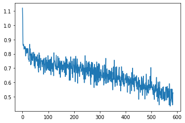

## Validation Loss

After each epoch, network is validated on the validation dataset. Here is the graph - 

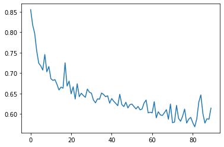

The dataset is very small - 200 images. Hence there is an overfitting after around 80 epochs. Dropout layers and data augmentation is used can be improved to avoid the overfitting problem. 

## Detection Demo Images 

Some results on validation set images 

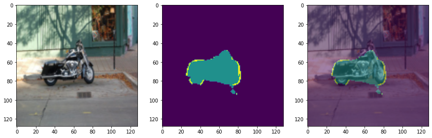
--- 
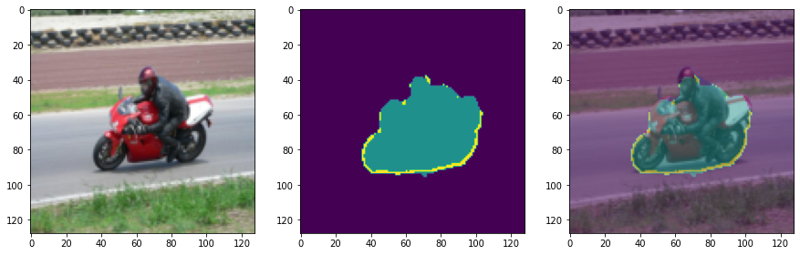
--- 
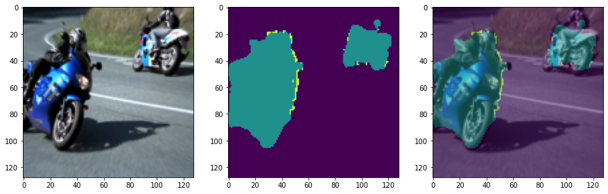
--- 
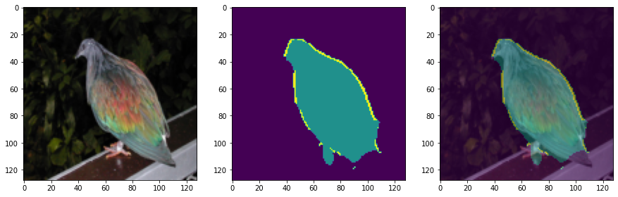
--- 
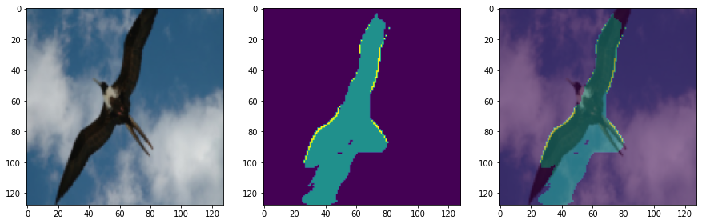
--- 
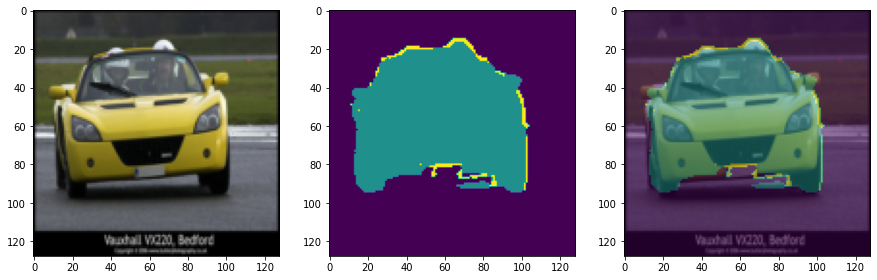
--- 
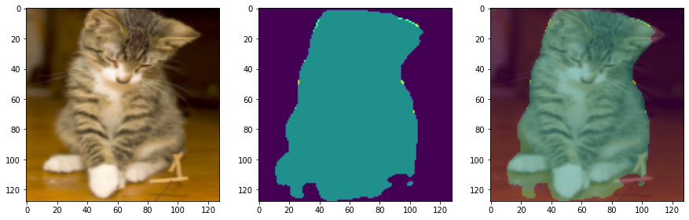
--- 
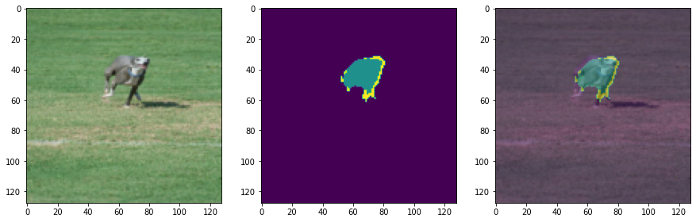
--- 
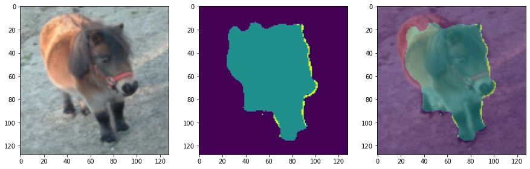
 --- --- 